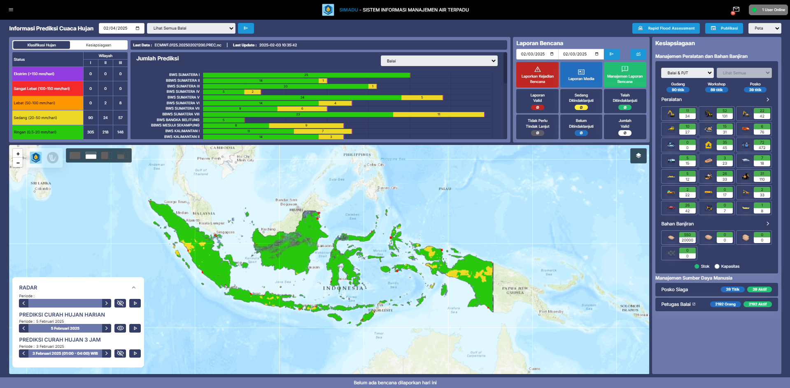
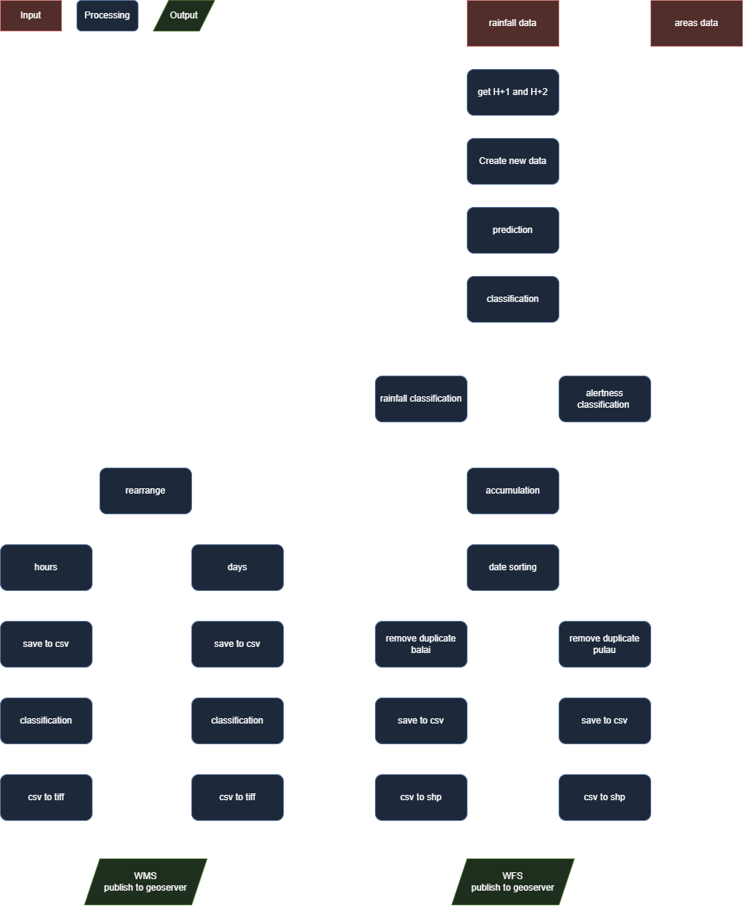

## Rainfall Prediction

   

## Introduction

This notebook contains analysis and prediction of rainfall based on raster data or numerical datasets. Includes data processing processes, statistical analysis, and prediction models to help understand rainfall patterns and estimate future rainfall.

## Workflow of the rainfall prediction

   

## Features

- Analyzing rainfall data for trends and patterns using statistics.
- Developing predictive models to estimate future rainfall.
- Visualizing outcomes through graphs and maps.

## Tech Stack

- Python
- Pandas
- Numpay
- Rasterio
- GeoPandas
- Geoserver
